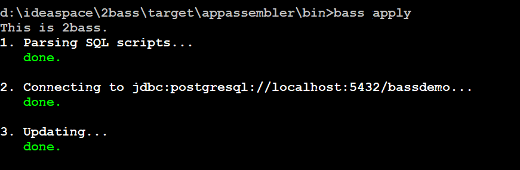
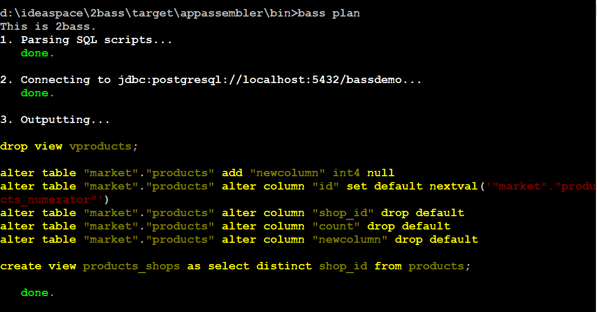
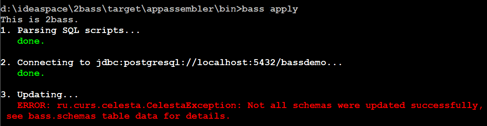

= 2BASS

image::https://ci.corchestra.ru/buildStatus/icon?job=2bass/dev[link=https://ci.corchestra.ru/job/2bass/job/dev/]
image:https://api.codacy.com/project/badge/Grade/f26a1fbeb3f341f39594d16ede78d7b9["Codacy code quality", link="https://www.codacy.com/app/CourseOrchestra/2bass?utm_source=github.com&utm_medium=referral&utm_content=CourseOrchestra/2bass&utm_campaign=Badge_Grade"]
image:https://awesome.re/mentioned-badge.svg["Mentioned in Awesome database tools", link=https://github.com/mgramin/awesome-db-tools]

2bass is a database configuration-as-code tool that utilizes the concept of https://dzone.com/articles/trouble-free-database-migration-idempotence-and-co[idempotent DDL scripts].

This is a derivative of link:https://github.com/CourseOrchestra/celesta[Celesta project], in particular, it uses link:https://courseorchestra.github.io/celesta/en/#CelestaSQL[CelestaSQL] as database definition language.

:toc:

== Current status

This project is in development phase. For binaries see link:https://github.com/CourseOrchestra/2bass/releases[releases], or see <<How to build>> if you want to build the freshest binary yourself. If you want to contribute (suggestions/feature requests are very welcome!) please feel free to contact any of the contributors.

== How to build from sources

You will need JDK 8 and Maven in order to build 2bass. If you want to run tests during the build, you will also need Docker to be installed. To build without compiling and running the tests, run

 mvn package -Dmaven.test.skip=true

The result of the build will be `target/2bass-<VERSION>-bin.zip` file.

== How to install and run

Prerequisites: JRE 8. Unzip `target/2bass-<VERSION>-bin.zip` file and make `bin` folder availiable on system path.
Run `bass` command and check its output.

== How to use
* Usage example is available at https://github.com/inponomarev/2bass-demo.

* Usage:

 bass <command> <options>

* Available commands are:

** `validate`         Parse and validate SQL scripts (with no connection to database).
** `init`             Initialize system `bass` schema.
** `plan`             Generate and show DDL execution plan for review / manual exectution.
** `apply`            Build or change database structure.
Sync your actual DB structure with the desired structure described in your SQL files.
All the ALTER commands are calculated and executed automatically. You may run `apply` without running `init` previously

* Options are:

 [--debug] [--jdbc.password=<password>] [--jdbc.url=<url>]
        [--jdbc.username=<username>] [--outputFilePath=<path>]
        [--propertiesFile=<path>] [--score.path=<path>]

**   `--debug`                      Debug mode: show exception stack traces
**   `--jdbc.password=<password>`   Database password
**   `--jdbc.url=<url>`             JDBC connection URL
**   `--jdbc.username=<username>`   Database user name
**   `--outputFilePath=<path>`      Path to write scripts to (for `plan` command)
**   `--propertiesFile=<path>`      Path to .properties file with options (options set
                                in command line have higher priority)
**   `--score.path=<path>`          Path to SQL scripts

* Write and modify your database schema using CelestaSQL, which is in fact the plain old DDL.
Е. g. you may use CREATE TABLE for table definition, and then simply add/modify columns in the script when you need it,
no 'ALTER' commands in schema definition script. You may also use `EXEC NATIVE` blocks when you need to insert
database-specific code. See our https://github.com/inponomarev/2bass-demo[demo project] and https://corchestra.ru/wiki/index.php?title=%D0%AF%D0%B7%D1%8B%D0%BA_Celesta-SQL[wiki page] (in Russian, but with nice diagrams) about CelestaSQL.

* Example outputs for `apply` and `plan` commands:

=== If something goes wrong during database migration

Sometimes bass is not able to perform the migration fully automatically. In this case will see the following:

and for further details you should look at the contents of the `bass.schemas` table. In `message`
field you will see the error that prevented the automatic migration. The meaning of numbers in `state` column is
as following:

* **0** -- schema created/migrated successfully, will not attempt to migrate unless the checksum of DDL script is changed.
* **1** -- schema is currently in process of migration.
* **2** -- migration error (see `message` column for details).
* **3** -- force migration, regardless of DDL script checksum. In case of success the status will become **0**.
* **4** -- never migrate this schema, regardless of DDL script changes.

Normally in case of errors you should:

1. Write and execute an ad hoc migration script.
2. Change schema status to 3.
3. Re-run `bass apply`.
